# Laravel In DB Performance Monitor

Monitor your laravel application performance by logging requests in your database then analyze it. The log includes request parameters, actions, SQL queries and errors beside that you can know the requests with raw SQL queries.
[Demo](http://asamirdemos.codeagroup.net "Demo")

## Table of contents

<!--ts-->
   * [Requirements](#requirements)
   * [Installation](#installation)
   * [Documentation](#documentation)
      * [Configurations](#configurations)
      * [Routes](#routes)
      * [Demo Screen shots](#demo-screen-shots)
	      * [/admin-monitor](#admin-monitor)
	      * [/admin-monitor/dashboard](#admin-monitordashboard)
	      * [/admin-monitor/requests](#admin-monitorrequests)
	      * [/admin-monitor/request/{id}](#admin-monitorrequestid)
	      * [/admin-monitor/statistics-report](#admin-monitorstatistics-report)
	      * [/admin-monitor/errors-report](#admin-monitorerrors-report)
	      * [/admin-monitor/archives-report](#admin-monitorarchives-report)
	      * [/admin-monitor/ips-report](#admin-monitorips-report)
	      * [/admin-monitor/change-password](#admin-monitorchange-password)
   * [Best Practices](#best-practices)
   * [New Features and Upgrade](#new-features-and-upgrade)
   * [Generate Dummy Requests](./tests)
   * [Author](#author)
<!--te-->

## Requirements

    Laravel >=5.1

## Installation

1- Run `composer require asamir/laravel-in-db-performance-monitor`

2- For **laravel < 5.5** add this provider in **config/app.php**

	'providers' => [
		\\...
		ASamir\InDbPerformanceMonitor\InDbPerformanceMonitorProvider::class,
	]

3- Run `php artisan in-db-performance-monitor:init`

4- Add and configure the **inDbMonitorConn** connection in **config/database.php file** => **Hint:** the package .env variables is created for you by the previous command:

    'connections' => [
        //...
        'inDbMonitorConn' => [
            'driver' => 'mysql',
            'host' => env('IN_DB_MONITOR_DB_HOST', ''),
            'port' => env('IN_DB_MONITOR_DB_PORT', '3306'),
            'database' => env('IN_DB_MONITOR_DB_DB', ''),
            'username' => env('IN_DB_MONITOR_DB_USERNAME', ''),
            'password' => env('IN_DB_MONITOR_DB_PASSWORD', ''),
            'charset' => 'utf8',
            'collation' => 'utf8_unicode_ci',
            'prefix' => 'asamir_',
            'strict' => false,
            'engine' => null,
        ],
	]

5- Add the this middleware in **app/Http/Kernel.php** file 

    protected $middleware = [
        //...
        \ASamir\InDbPerformanceMonitor\InDbPerformanceMonitorMiddleware::class
    ];

6- Add this line in **app/Exceptions/Handler.php** => **public function report(Exception $exception)**

    public function report(Exception $exception) {
        //...
        \ASamir\InDbPerformanceMonitor\LogErrors::inDbLogError($exception);
        
        parent::report($exception);
    }
    //..Hint For laravel < 5.3 => instead of $exception it will be $e

7- Run `php artisan migrate`

**Now you can make requests and monitor it at /admin-monitor**

**Remember to open config/inDbPerformanceMonitor.php to set your custom configurations**

## Documentation
### Configurations

- The **inDbMonitorConn** connection is where the requests logs will be set, so it can be isolated in another database away from the application database or you can set it in the same database no problem.

- The package creates **inDbPerformanceMonitor.php** file in your config folder which has options
	- **IN\_DB\_MONITOR\_WORK** => If true the package will work and log the comming requests (default = true)

	- **IN\_DB\_MONITOR\_PANEL** => If false the admin panel will not be accessible and any link to '/admin-monitor/*' with throw 404 (default = true)

	- **IN\_DB\_MONITOR\_TOKEN** => Holds the admin-monitor passowrd token (default password = monitor)

	- **IN\_DB\_MONITOR\_NEGLICT\_START\_WITH** => Array of routes to neglict from log (e.x. /test so any request start with /test will not be  logged in the DB)

	- **IN\_DB\_MONITOR\_NEGLICT\_REQUEST\_DATA** => If true request data will not be logged and will be replaced with ['%\_\_ALL\_HIDDEN\_\_%'] (default = false)
	
	- **IN\_DB\_MONITOR\_NEGLICT\_PARAMS\_CONTAIN** => Fields in the request which contain any of these names will not be logged and it will be replaced with %\_HIDDEN\_%

	- **IN\_DB\_MONITOR\_NEGLICT\_SESSION\_DATA** => If true session data will not be logged and will be replaced with ['%\_\_ALL\_HIDDEN\_\_%'] and will log the session id only (default = false)
	
	- **IN\_DB\_MONITOR\_LOG\_PACKAGE\_QUERIES** => If true log queries made by the package in your laravel log (default = false)

	- **IN\_DB\_MONITOR\_GET\_IP\_INFO** => If true get IP location data (default = true)

	- **IN\_DB\_MONITOR\_GET\_IP\_CLASS** => You can change it and use your own class with new third party web services to get the IP location.
	
- **Hint:** You will find the package env variables created in your .env file

### Routes

- **/admin-monitor** => The login page (default password = monitor).
- **/admin-monitor/dashboard** => Dashboard with requests counts.
- **/admin-monitor/requests** => List all requests and provided with search panel to filter the results.
- **/admin-monitor/request/{id}** => Display request details.
- **/admin-monitor/run-query/{id}** => Display query details and re-run it.
- **/admin-monitor/statistics-report** => Statistics report of requests performance group by request route uri and type.
- **/admin-monitor/errors-report** => Statistics report of requests errors group by page uri, type, and error message.
- **/admin-monitor/archives-report** => Statistics report of requests archives.
- **/admin-monitor/ips-report** => Statistics report of requests IPs Info.. Also you have the ability to recalculate the uncompleted IPs Info.
- **/admin-monitor/change-password** => Change the password of the admin monitor panel.
- **/admin-monitor/logout** => Logout from the admin monitor panel.
### Demo screen shots

**Hint: in the search boxes you can use the like wildcards like %%**

#### /admin-monitor

The login page (default password = monitor)
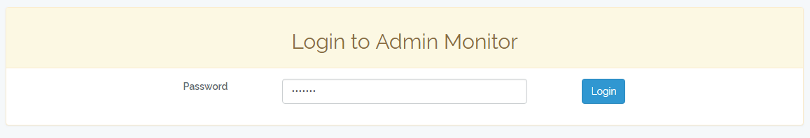

------------------------------------------------

#### /admin-monitor/dashboard

Dashboard with requests counts grouped by type and archive tag.
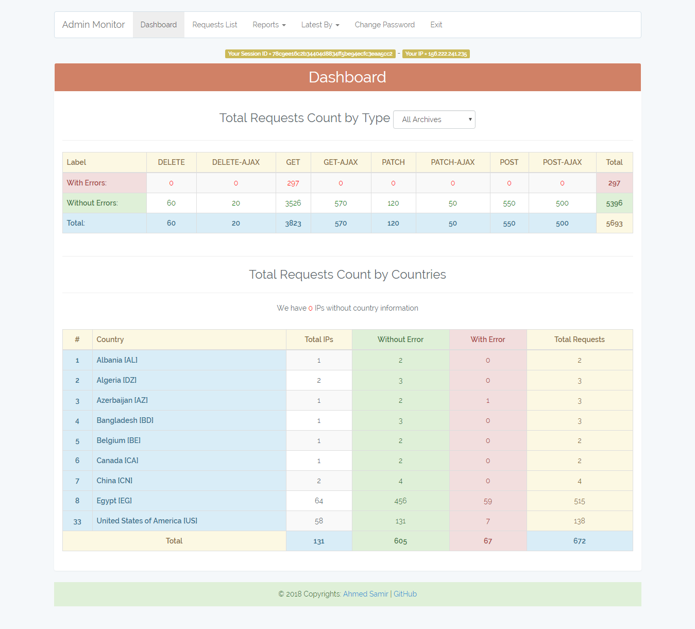

------------------------------------------------

#### /admin-monitor/requests

List all logged requests

- **Search box:** search in (Action, Route, URL, Session ID, Type[POST,GET,...], Archive Tag) and in (Error Message, Error File) in case of checked **Has errors** check box

- **Not Elequent:** I mean free queries like `\DB::select(\DB::raw('select * from applicants where id = 10'));` this queries are vulnerable to SQL injection attacks. The number in red color represents the number of free queries in the request. 

- **Archive button:** Give tag => date('YmdHis') to requests with archive tag = 0 

- In the table you will find number of queries, queries total time, and request execution time.

- You can filter by creation date from => to

- If you hovered the Error label, it will display the error message, file, and line number.

- The scenario of the requests in the image below
	- Create applicant 
	- Edit Applicant
	- Search Applicant
	- Delete Applicant
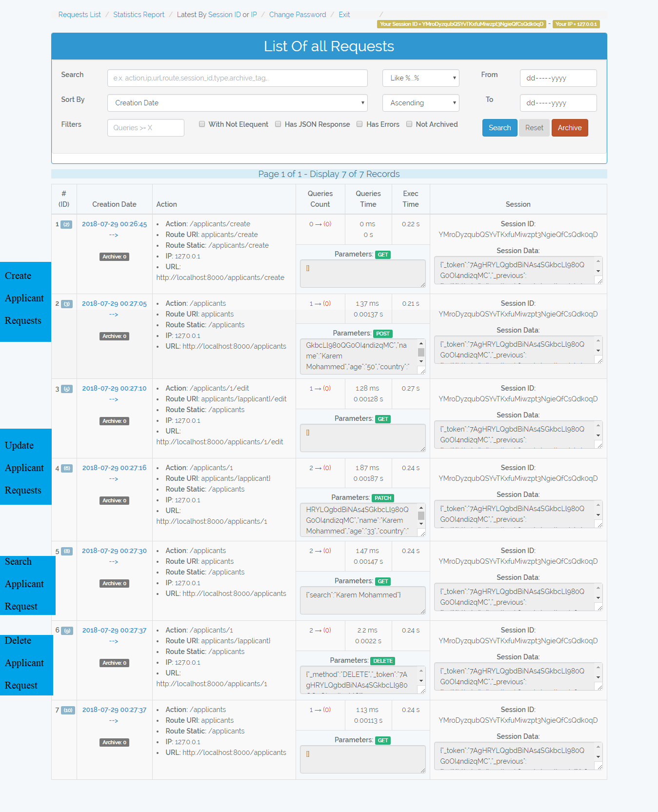

- The scenario of the requests in the image below
	- Archive old requests so the appear with tag 20180729010530 and the others with tag 0 => So we can filter them 
	- Make request to **/add/{a}/{b}** which adds two integers. I passed to it 4 and 5+, so it throwed exception because 5+ is not integer.   
	- Make request to **/api/applicants** which returns json response. Hint: I used a free query `\DB::select(\DB::raw('select * from applicants'));` to retreive applicants, also notice that the request session id changed because it is not under the web middleware. 
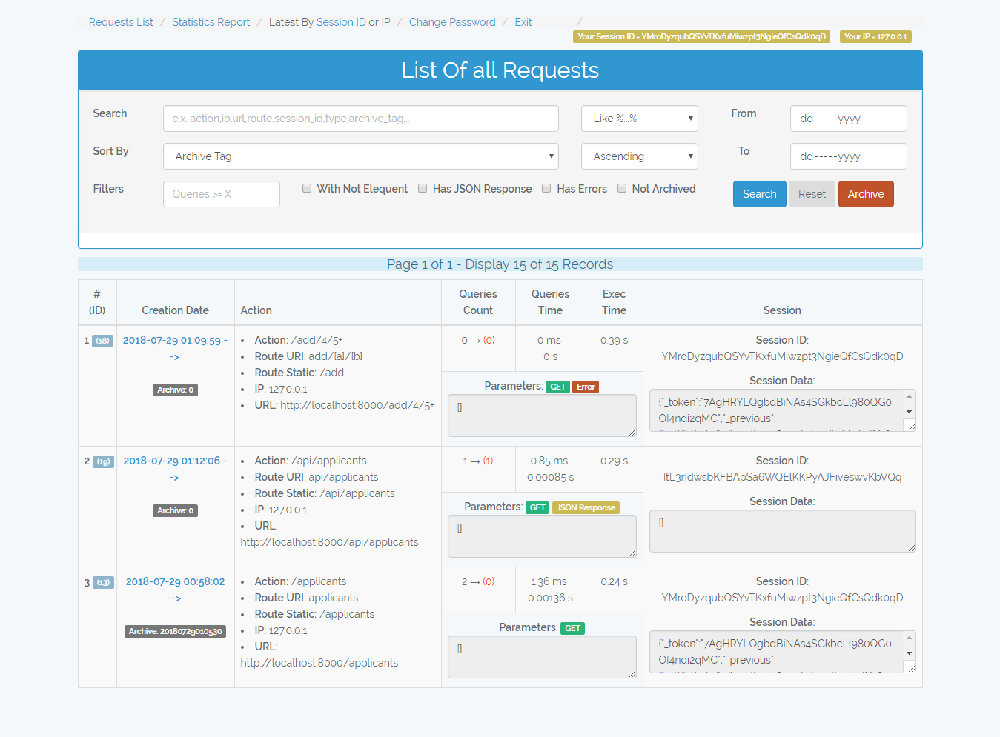

------------------------------------------------

#### /admin-monitor/request/{id}

Shows the request details, queries, and error beside that it allows you to re-run the queries.

	Hint => You can quickly get your last request by Latest By Session ID Or IP
	
	By Session ID => Get last request made by your session id
	
	By IP => Get last request made by your ip (requests made by api or routes
	which don't use the web middleware will generate different session id at
	every request, so you can get them by your IP).

- Request of create applicant
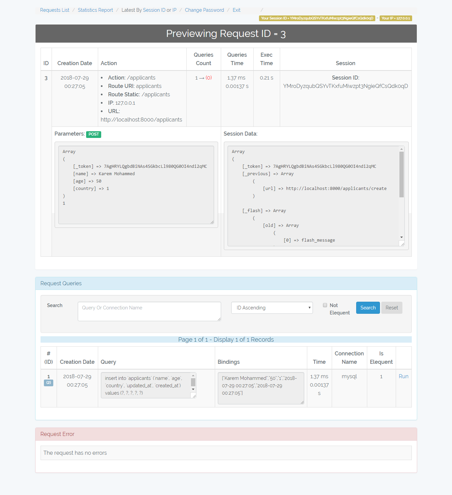
...
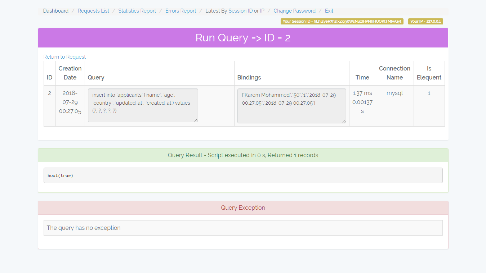

- Request of search applicants
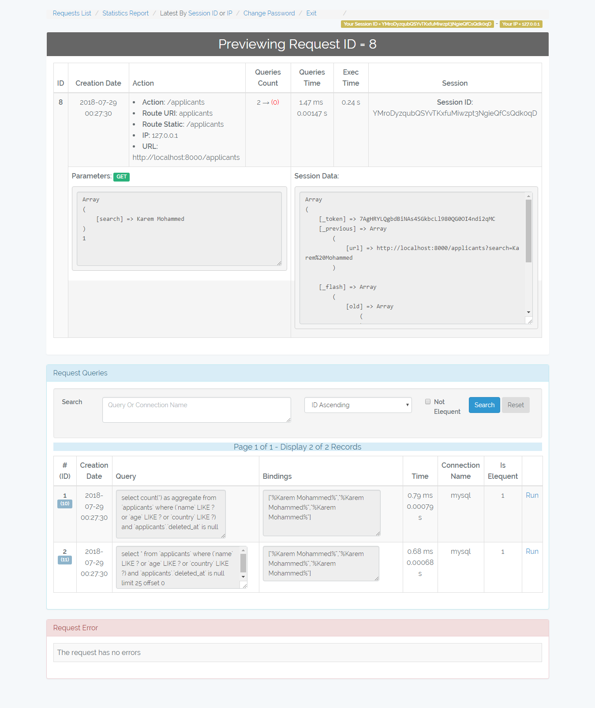
...
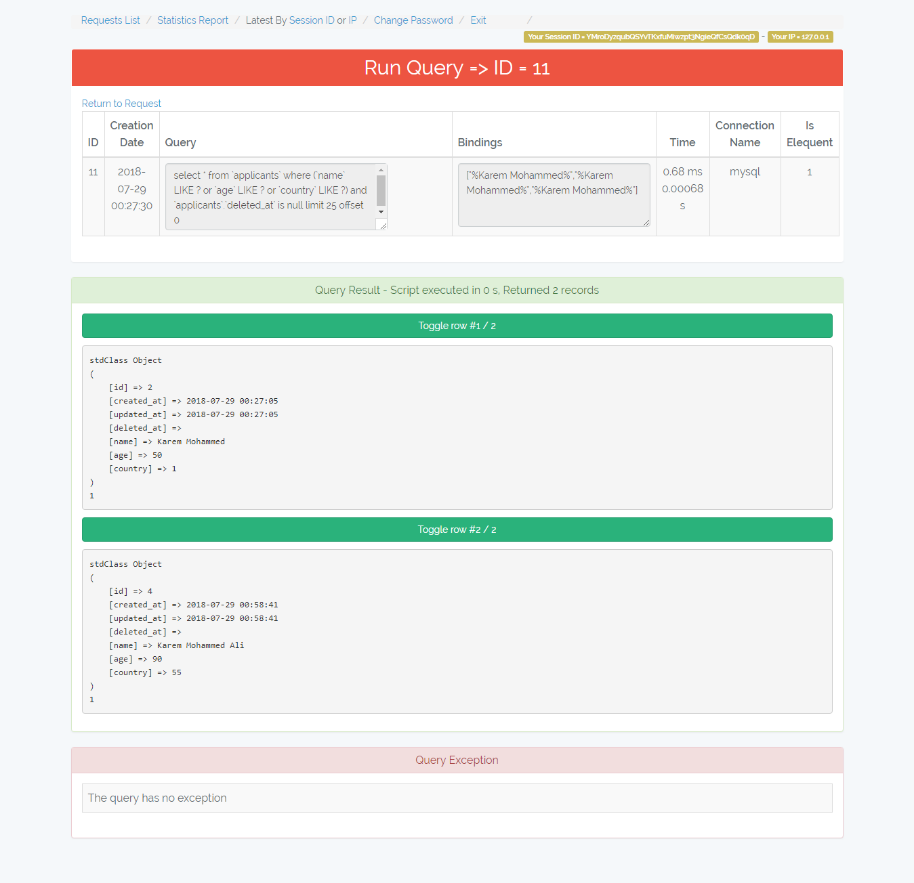

- Request of error add/4/5+
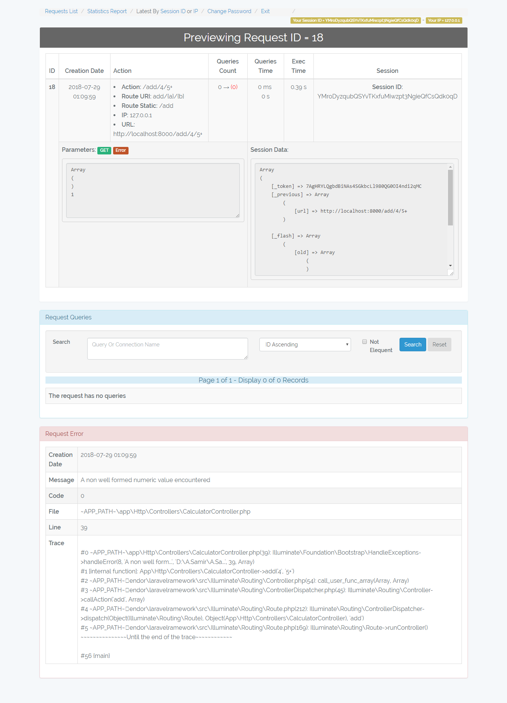

------------------------------------------------

#### /admin-monitor/statistics-report

Statistics report about the requests performance group by request route uri and type.

------------------------------------------------

#### /admin-monitor/errors-report

Statistics report of requests errors group by page uri, type, and error message.
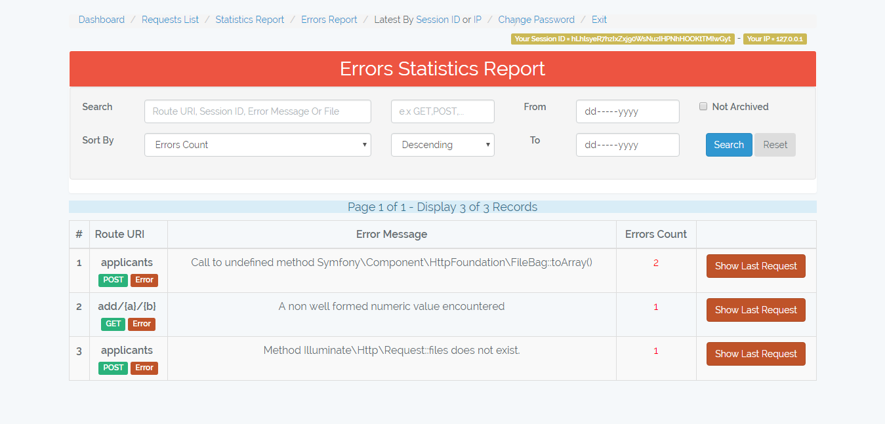

------------------------------------------------

#### /admin-monitor/archives-report

Statistics report of requests archives.
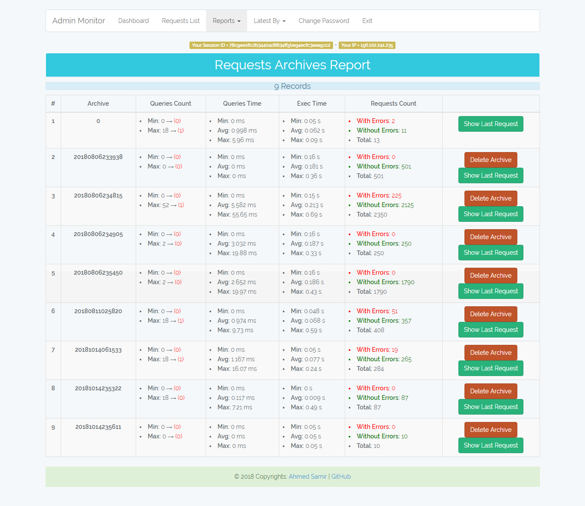

------------------------------------------------

#### /admin-monitor/ips-report

Statistics report of requests IPs. Also you have the ability to recalculate the uncompleted IPs Info.
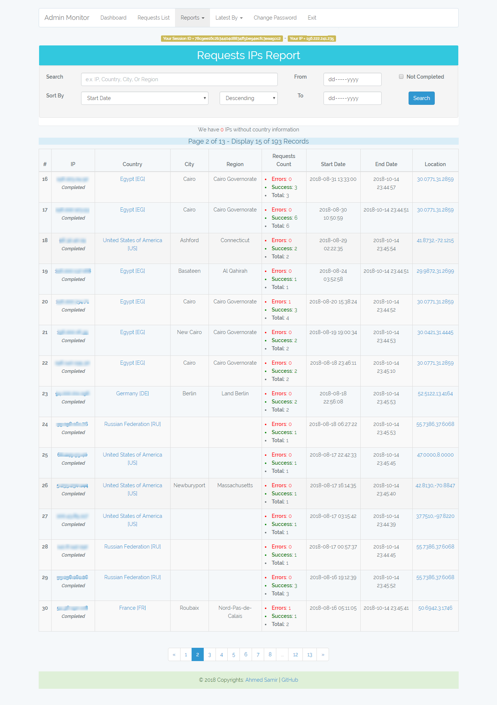

------------------------------------------------

#### /admin-monitor/change-password

To change admin monitor panel password.
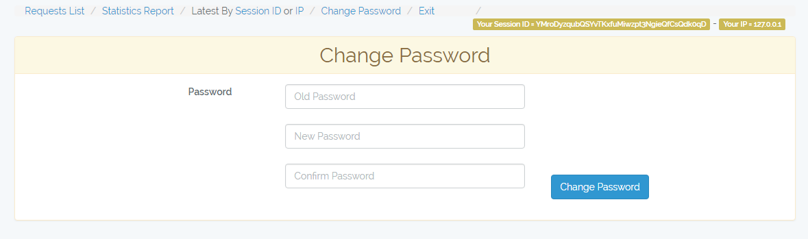

## Best Practices

I was working on a project and my task was to test the application performance and list the requests with performance issues. The problem was that after migrating the data and the database size became larger the application performance decreased and sometimes crashes. Instead of loop on all the application code and check every line on it, I built a listener to log the requests data (queries) run by the application then I analyzed this data and quickly found the requests with weak points. As a result of this, I built the laravel-in-db-performance-monitor package and published it to be used by anyone.

**Here are some tips for best practices:**

- Put the log tables in a separated database, because it's size increase rapidly.
- Switch the logger on: 
	- In the development and testing stages to analyze the performance of your requests and check your queries.
	- In the production for a small period (e.x. first week) to monitor the application performance and understand your users behaviors. After that switch it off (Set **IN\_DB\_MONITOR\_WORK**=false).
	- In case of any issue to debug the request queries and error.
	- Remember to set (**IN\_DB\_MONITOR\_PANEL**=false) when your application is online, so the /admin-monitor links will not be accessible and set it to true when you want to debug something or review the reports.
- Set your custom configurations in the **config/inDbPerformanceMonitor.php** file specially the **IN\_DB\_MONITOR\_NEGLICT\_START\_WITH** and **IN\_DB\_MONITOR\_NEGLICT\_PARAMS\_CONTAIN** parameters.
- Use the **"Latest By Session ID or IP"** to get your last request quickly without searching.
- Change the password to a complex one.
- Use the **"Statistics Report"** to detect the requests which have performance issues by max queries count, max queries time, max execution time, non elequent queries count, and so on. 
- Use the **"Errors Report"** to detect the most frequent exceptions happened in your system.
- Check the generated queries of the third party packages you use.
- Check the request which preview lists (e.x. list of customers) and make sure that you use pagination and loaded the relations correctly by using the laravel "with()" function.
	- e.x. if model customer has relation with model orders, and model products and we will display 10 customers => (without "with()" laravel will generate 21 query - but by using "with()" it will be 4 queries only).
- Check the requests of your dashboards and reports and make sure that you use the sql aggregation functions correctly.

--------------------

## New Features and Upgrade

- Get the request country and location Info.
- Storing data as serialized string instead of encoded JSON.
- Add more reports and statistics.
- Enhance the UI and Fix Issues.

Hint: If you are using an older version (<v2) please run this command after upgrade

	php artisan in-db-performance-monitor:init --ips=true --serialize=true

and add this lines in config/inDbPerformanceMonitor.php

    'IN_DB_MONITOR_GET_IP_INFO' => env('IN_DB_MONITOR_GET_IP_INFO', true),
    'IN_DB_MONITOR_GET_IP_CLASS' => '\\ASamir\\InDbPerformanceMonitor\\IPInfo',

#### Dummy Data => [Demo](http://asamirdemos.codeagroup.net/admin-monitor "http://asamirdemos.codeagroup.net") (password=monitor)

## Author

**Ahmed Samir**

**Contacts:** [eng.ahmed.samir.fci@gmail.com](mailto:eng.ahmed.samir.fci@gmail.com) | [Linkedin](https://www.linkedin.com/in/ahmed-samir-58250284/)

